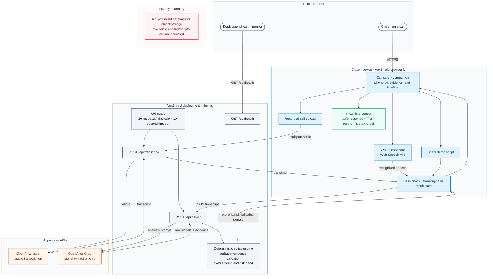

# VoxShield

Real-time voice security agent that listens to live conversations, transcribes speech in the browser, detects potential social-engineering patterns, and calculates a deterministic risk score — all on one screen.

Built for the Independence Day AI Hackathon (Theme: Security).

## The Problem

Scam calls work because nobody is listening for manipulation *as it happens*. Number-blocking tools only help before you pick up. Once you're on the call, urgency, fake authority, and OTP requests pile up faster than most people can evaluate them.

## How It Works



**Separation of concerns (real in code, not just marketing):**

1. **LLM extractor (OpenAI or Groq)** — identifies potential patterns and returns verbatim evidence substrings. It never assigns scores or makes security decisions.
2. **Policy engine** (`lib/policy.ts`) — validates evidence against the transcript, applies fixed point values, caps at 100, and determines risk bands.

### Signal Types & Scoring

| Pattern | Points |
|---------|--------|
| OTP / credential request | +35 |
| Payment pressure (UPI, gift cards, crypto) | +25 |
| Remote access request (AnyDesk, TeamViewer) | +20 |
| Urgency language | +15 |
| Authority impersonation | +15 |
| Suspicious link / download | +15 |
| Isolation language | +10 |

**Risk bands:** 0–24 LOW · 25–49 CAUTION · 50–74 HIGH · 75–100 CRITICAL

## Privacy

- Live microphone audio is **not stored** — browser speech capture stays in the session
- Uploaded call audio is sent to Whisper for transcription; transcripts are sent to the configured OpenAI or Groq extractor only during the session
- Nothing is persisted to a database or disk

## Run Locally

```bash
cd voxshield
cp .env.local.example .env.local
# Add your free Groq API key to .env.local

npm install
npm run dev
```


### Demo Options

1. **Live mic** — click "Start Listening" and speak a scam scenario
2. **Demo script** — click "Load Demo Script" for a hardcoded banking-scam transcript through the same pipeline

## Stack

- Next.js 14 + Tailwind CSS
- Browser Web Speech API (transcription)
- Groq API (signal extraction)
- Browser SpeechSynthesis (safe response playback)

## Framing

VoxShield detects **potential social-engineering patterns**, not certainty that someone is a scammer. The deterministic policy engine makes the security decision; the LLM only extracts evidence.
